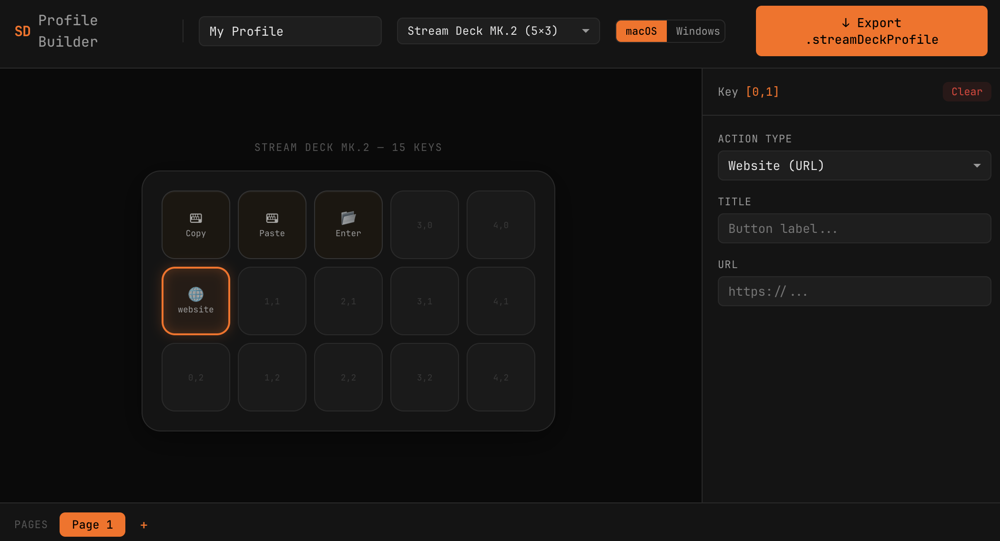

# 🎛️ Stream Deck Profile Builder

**Create custom Elgato Stream Deck profiles without the desktop app.**

Build hotkeys, macros, website launchers, multi-action sequences, and more — all from your browser. Export a ready-to-import `.streamDeckProfile` file in seconds.

> No account. No install. No backend. Just open, configure, and download.

<br/>

<p align="center">
  
</p>

<br/>

## ✨ Why This Exists

The official Stream Deck app is great for clicking around, but if you want to:

- 🚀 **Quickly scaffold a profile** for a new project or workflow
- 🔧 **Programmatically define** keyboard shortcuts, URLs, and macros
- 📦 **Share profiles** with your team without exporting from the desktop app
- 💻 **Work from any machine** — even one without Stream Deck software installed

...then this tool is for you.

## 🎮 Supported Devices

| Device | Grid | Keys |
|--------|------|------|
| Stream Deck Mini | 3×2 | 6 |
| Stream Deck Neo | 4×2 | 8 |
| Stream Deck MK.2 | 5×3 | 15 |
| Stream Deck XL | 8×4 | 32 |
| Stream Deck + | 4×2 | 8 |
| Stream Deck + XL | 6×6 | 36 |
| Stream Deck Pedal | 3×1 | 3 |
| Stream Deck Studio | 8×4 | 32 |

## ⚡ Action Types

| Action | What it does |
|--------|-------------|
| ⌨️ **Hotkey** | Send keyboard shortcuts (macOS & Windows key codes) |
| 📂 **Open** | Launch apps or files |
| 🌐 **Website** | Open URLs in your browser |
| 🔤 **Text** | Type a string (with optional Enter) |
| ▶️ **Multi-Action** | Run a sequence of actions with delays |
| 🔄 **Multi-Action Toggle** | Two-state sequences (on/off) |
| 🧭 **Navigation** | Switch profiles, pages, folders |
| 🎵 **Media** | Play/pause, volume, track skip |

## 🛠️ Tech Stack

- **React 19** + **TypeScript** — type-safe UI with modern React
- **Vite** — lightning-fast dev server and builds
- **Zustand** — minimal state management (~1KB)
- **JSZip** — client-side ZIP generation for `.streamDeckProfile` export
- **JetBrains Mono** — monospaced font for that developer aesthetic
- **Cloudflare Pages** — static deployment, zero cold starts

## 🚀 Getting Started

```bash
# Clone and install
git clone https://github.com/your-username/streamdeck-profile-builder.git
cd streamdeck-profile-builder
npm install

# Start dev server
npm run dev

# Build for production
npm run build
```

## 📖 How It Works

1. **Pick your device** — select your Stream Deck model from the dropdown
2. **Click a key** — the visual grid mirrors your actual device layout
3. **Configure an action** — choose the action type and fill in the details
4. **Add pages** — build multi-page profiles with the page bar
5. **Export** — hit the orange button, get a `.streamDeckProfile` file
6. **Import** — double-click the file to load it into the Stream Deck app

The exported file is a standard V2 `.streamDeckProfile` (ZIP archive) compatible with Stream Deck software 6.x and later.

## 📁 Project Structure

```
src/
├── components/          # React UI components
│   └── actions/         # Per-action-type form components
├── lib/                 # Pure logic (no React)
│   ├── types.ts         # All TypeScript interfaces
│   ├── devices.ts       # Device definitions
│   ├── keycodes.ts      # macOS + Windows key code tables
│   ├── actions.ts       # Action config → wire format converters
│   ├── profile-builder.ts  # Store state → profile definition
│   └── zip-generator.ts    # Profile → .streamDeckProfile ZIP
└── store/               # Zustand state management
```

## 🤝 Contributing

Contributions are welcome! Some ideas:

- 🎨 Button icon editor (canvas-based 288×288 PNG generation)
- 📥 Import existing `.streamDeckProfile` files for editing
- 📋 Pre-built profile templates (developer, streaming, productivity)
- 🔌 Plugin action support (OBS, Twitch, Philips Hue, etc.)

## 📄 License

MIT

---

<p align="center">
  Built with 🧡 for developers who love their Stream Decks
</p>
